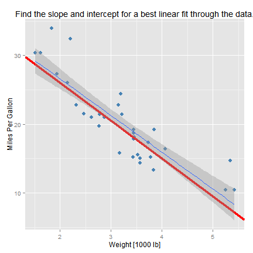
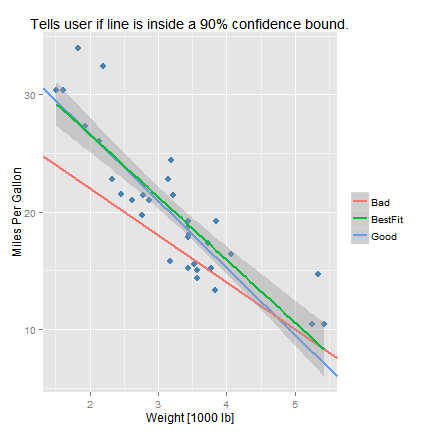

---
title       : Check My Fit
subtitle    : Simple app to play around with linear fitting
author      : MattDSquared
job         : 
framework   : io2012        # {io2012, html5slides, shower, dzslides, ...}
highlighter : highlight.js  # {highlight.js, prettify, highlight}
hitheme     : tomorrow      # 
widgets     : [mathjax]     # {mathjax, quiz, bootstrap}
mode        : selfcontained # {standalone, draft}
knit        : slidify::knit2slides

--- &twocol

## Why should I Check My Fit?

*** =left

* Ever wonder what it means to fit a line through some data?

* This app helps you learn it how it works!

*** =right

 

--- &twocol .class #id 

## Interactive User feedback

*** =left

* Better understand what that grey region is on ggplot2 smooth plots.

* Here's an example for a line with the form $y = A + B x$:

<!-- html table generated in R 3.2.2 by xtable 1.7-4 package -->
<!-- Sun Sep 27 16:01:12 2015 -->
<table border=1>
<tr> <th> Fit </th> <th> A </th> <th> B </th>  </tr>
  <tr> <td> Good </td> <td align="right"> 38.00 </td> <td align="right"> -5.70 </td> </tr>
  <tr> <td> Bad </td> <td align="right"> 30.00 </td> <td align="right"> -4.00 </td> </tr>
   </table>

* The app will let you know if you were close to the actual fit line by comparing the intercept (A) and slope (B) to the 90% confidence interval of these parameters.  

*** =right

 

--- .class #id 

## How to use it

Simply start by guessing the intercept and slope in the input boxes, trying to minimize the means squared error (MSE) of the line. Then once you think you have it, click 'Check it', and the app will let you know how you did. 

--- .class #id 

## Where to go get it

* The app is hosted by shinyapps.io on my account:  
https://mattdsquared.shinyapps.io/CheckMyFit

* The source code can be found on my github account:  
https://github.com/MattDSquared/CheckMyFit

* The data used for this app is the classical mtcars data set built into R. 
